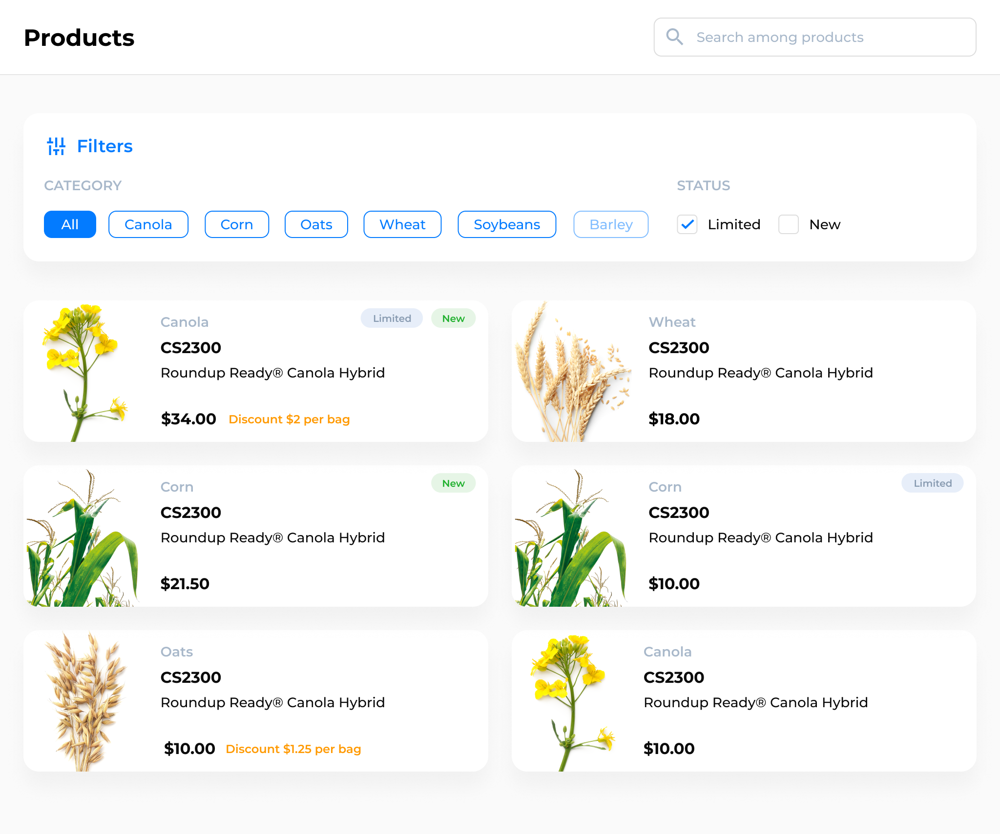

## Особенности реализации

- Если запрос категорий завершился ошибкой, пользователь об этом не узнает. Почему так:

  Отсутствие категорий не блокирует работу пользователя - он может работать с другими фильтрами и использовать поиск. Поэтому мне не хотелось пугать ошибкой и призывать к дополнительным действиям в этом случае. 
  
  Возможно, с точки зрения UX это не самое правильное решение, но в обычной жизни я бы посоветовалась с командой.
  
- Решила не блокировать фильтры, пока пользователь ждет список продуктов на свой предыдущий запрос. 
  
  Для этого доработала хук, чтобы результаты запросов не перемешивались и в интерфейсе всегда рендерился список продуктов, соответствующий последнему фильтру. 

  Результат актуальный, даже когда пользователь кликает по фильтрам очень быстро.
  
- Значение инпута поиска обновляет фильтр для запроса продуктов в случае:
  - нажатия на return/enter, 
  - потери фокуса (onBlur) - мне показалось это удобным.

- Если для категории продуктов не предусмотрено изображение, вместо изображения рендерится грустный серый текст.

- Карточки сделаны ссылками, cсылка в качестве заглушки ведет на '/'. Мне просто очень захотелось сделать для карточки hover и focus :sparkles:

- Если запрос продуктов по каким-либо фильтрам завершился ошибкой, фильтры не откатываются в предыдущее состояние. Тут я вспомнила, что доводить до продакшен-состояния не требуется :sloth:

- У кастомного чек-бокса не предусмотрено состояние disabled - оно не понадобилось.

- Это мой первый опыт работы с Sass. Хотела еще сделать миксины для типографики и поработать с локальными переменными в отступах, но побоялась навертеть лишнего и черезчур усложнить стили.


## Задача

#### Реализовать компонент для отображения списка продуктов из API с выбранным фильтром и поиском.



**Фильтр по категории**: позволяет отфильтровать продукты по одной или нескольким категориям и сбросить выбор по клику на опцию `All`. Список категорий нужно получить из API.

**Фильтры по статусам**: позволяют отфильтровать продукты по выбранному статусу.

**Поле поиска** позволяет искать в списке продуктов по названию/описанию с учетом фильтров.

*Фильтрация и поиск реализованы на стороне API, нужно только передать правильные параметры. По умолчанию в фильтрах ничего не выбрано*.

## Дизайн

Макет [в Фигме](https://www.figma.com/file/sOoPi2gOZvfqjOQHa9awMC/Agro.Club-Home-project-Junior-Dev). 

Список нужно сверстать адаптивно:
- [для десктопа](https://www.figma.com/file/sOoPi2gOZvfqjOQHa9awMC/Agro.Club-Home-project-Junior-Dev?node-id=5477%3A11) 
- [для планшетов](https://www.figma.com/file/sOoPi2gOZvfqjOQHa9awMC/Agro.Club-Home-project-Junior-Dev?node-id=5480%3A6814)
- для мобильных устройств адаптируйте имеющийся дизайн самостоятельно, постарайтесь сделать его как можно более консистентным

## API

Вместе с запуском проекта локально запускается API. С методами API можно ознакомиться на [http://localhost:4000/swagger/](http://localhost:4000/swagger/).

⚠️ Чтобы приблизить работу с API к реальным условиям, запросы иногда будут завершаться с ошибкой. Ответы от API приходят с искусственной задержкой от 100мс до 1000мс. ⚠️

В API два эндпойнта:
#### `GET /api/category` - список категорий
```json
[
  {
    "id": "string",
    "name": "string",
    "type": "string"
  }
]
```
#### `GET /api/product` - список продуктов
```json5
  {
    "results": [
      {
        "id": "string",
        "name": "string",
        "description": "string",
        "categoryId": "string",
        "categoryName": "string",
        "categoryType": "string", 
        "isLimited": "boolean",
        "isNew": "boolean",
        "price": "number",
        "discount": "number | null"
      }
    ]
  }
```

`GET /api/product` принимает параметры:
- `isNew`  boolean 
- `isLimited`  boolean 
- `category`  [string] 
- `search` string

❕ API ничего не знает про изображения в карточке продукта, поэтому вам нужно сопоставить категорию с картинкой самостоятельно. В макете есть [отдельная секция](https://www.figma.com/file/sOoPi2gOZvfqjOQHa9awMC/Agro.Club-Home-project-Junior-Dev?node-id=740%3A0) со всеми категориями.

## Старт

> Для работы с проектом потребуется [Node.js](https://nodejs.org/en/) версии 14.x.x или выше.

1. Склонировать репозиторий 
```shell
git clone git@github.com:Agro-Club/junior-frontend-test.git
```
2. Установить модули
```shell
npm i
```
3. Запустить проект
```shell
npm start
```

После запуска проект будет доступен на [http://localhost:3000](http://localhost:3000). Внесённые правки будут сразу же отображаться в браузере (перезагружать страницу для этого не нужно).

## Что есть в проекте

#### Скелетон для клиент-серверного взаимодействия

В проекте уже есть хук  [`useProductList.js`](src/components/ProductList/useProductList.js) для работы с API. Он неидеален (как и всё в этом мире), поэтому, вероятно, вы захотите его доработать или же написать свою реализацию клиент-серверного взаимодействия — с помощью готовой библиотеки или самостоятельно. *Дисклеймер: использование этого хука не будет считаться минусом*.

#### Скелетон для списка

В [`ProductList.js`](src/components/ProductList/ProductList.js) реализован простой список, вы можете использовать его или написать свой.

#### Глобальные стили

В [`index.css`](src/index.css) подключен используемый в дизайне шрифт *Montserrat*, а также содержатся базовые стили для всего приложения (и вы можете их менять при необходимости).


#### [SASS](https://sass-lang.com/)

В файлах с расширением `.scss` можно использовать SASS-синтаксис. Если вы с ним не знакомы или предпочитаете обычный CSS, используйте расширение `.css`.

#### [CSS Modules](https://github.com/css-modules/css-modules)

Для изоляции стилей между компонентами вы можете использовать CSS модули. Для этого файлы со стилями должны иметь `.module` в названии  (например, `ProductList.module.scss`).

## Ограничения

Не изменяйте файлы за пределами папки `src` (внутри `src` можно как угодно менять/создавать любые файлы). Для решения задачи **можно** использовать любые внешние библиотеки, если они необходимы.

## Чеклист

Перед тем, как отправить ссылку с решением, убедитесь, что:

✅ Проект запускается

✅ Не осталось закомментированного кода

✅ В консоли нет ошибок/ворнингов

✅ Контент корректно отображается на любом разрешении в последних версиях Chrome, Safari, Firefox и Edge. Для тестирования в разных браузерах можно воспользоваться сервисом [BrowserStack](https://www.browserstack.com/).

✅ Фильтры фильтруют, поиск ищет 😎

## Как отправить выполненное задание

1. Запушить решение в свой публичный github-репозиторий.
2. Прислать ссылку на репозиторий на почту (будет указана в сообщении со ссылкой на это задание) c темой "Тестовое задание".

--------------------

Проект создан с помощью [Create React App](https://github.com/facebook/create-react-app).

